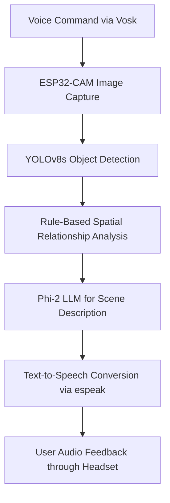

# AI-Powered Visual Assistance for the Blind

## Overview
A wearable AI-powered assistant that provides real-time scene understanding and voice feedback to visually impaired users.  
The system integrates **computer vision, spatial reasoning, and natural language processing** to describe the user's surroundings in real time using **YOLOv8s**, **rule-based spatial relationships**, **Phi-2 LLM**, and **espeak** for speech output.  
Deployed entirely on a **Raspberry Pi 5**, the system operates offline, ensuring low latency and privacy.

---

## Features
- Real-time object detection using YOLOv8s  
- Spatial awareness using rule-based relational mapping  
- Scene description generation using Phi-2 language model  
- Voice feedback via eSpeak text-to-speech engine  
- Voice command activation using Vosk (offline speech-to-text)  
- Fully functional offline operation on Raspberry Pi 5  
- Modular and scalable design for future enhancements  

---

## Tech Stack

| Component | Technology |
|------------|-------------|
| Hardware | Raspberry Pi 5, ESP32-CAM, Wired Headset |
| Software | Python, PyTorch |
| Models | YOLOv8s (Object Detection), Phi-2 (Natural Language Generation) |
| Libraries | OpenCV, Tesseract OCR, pyttsx3, transformers, Vosk, espeak |
| Platform | Raspberry Pi OS |

---

## System Architecture

---

## Results

| Metric | Description | Value |
|---------|--------------|--------|
| **Precision** | Accuracy of object detection (YOLOv8s) | 79.66 % |
| **Recall** | Correctly identified objects out of total | 66.39 % |
| **ROUGE-L Score** | Quality of generated scene descriptions | 72.9 % |
| **BLEU Score** | Linguistic fluency of generated text | 11.6 % |
| **Mean Opinion Score (MOS)** | Audio output clarity from eSpeak | 3.78 / 5 (~75.6 %) |
| **Processing Latency** | Average time per complete pipeline | ~1 minute |
| **Offline Capability** | Works without internet connectivity | Enabled |
| **Battery Runtime** | Continuous operation on portable pack | ~2.5 hours |

**Testing Summary**
- Deployed on Raspberry Pi 5 and evaluated in both indoor and outdoor environments.  
- Maintained consistent detection accuracy under varied lighting conditions.  
- Real-time narration improved navigation confidence for visually impaired users.  
- Achieved stable, low-latency performance with full offline operation.

---

## Future Enhancements
- Add multilingual speech output for regional accessibility.  
- Integrate GPS and ultrasonic sensors for navigation guidance.  
- Extend functionality with OCR and face-recognition modules.  
- Develop a companion mobile application for remote monitoring and settings.  
- Optimize power consumption for extended wearable use.  
- Incorporate haptic feedback for silent or low-noise alerts.  
- Redesign the hardware enclosure for improved ergonomics and comfort.  

---

## Team and Role

This project was developed as part of a 3-member team at Sri Sivasubramaniya Nadar College of Engineering, Chennai.  
I was primarily responsible for the **AI model integration, scene understanding logic, and system interface design**, ensuring smooth coordination between object detection, language generation, and voice feedback modules.  

Other team members contributed to **hardware configuration, camera integration, speech processing**, and **system testing**.  
Collaboration was managed using Git and version control to streamline development and testing cycles.

**Team Size:** 3  
**Duration:** January 2025 – April 2025  
**Institution:** Sri Sivasubramaniya Nadar College of Engineering, Chennai

---
